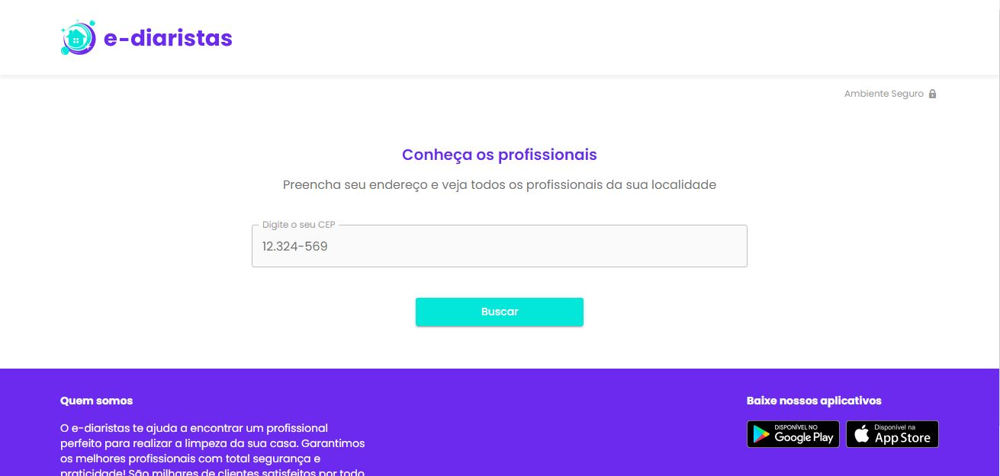
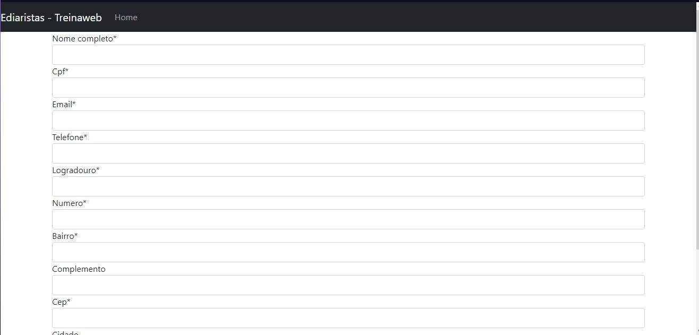
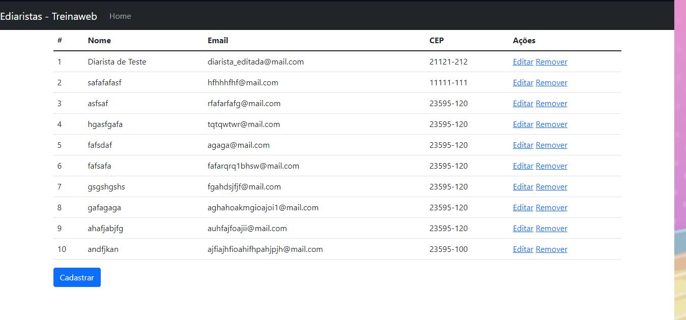
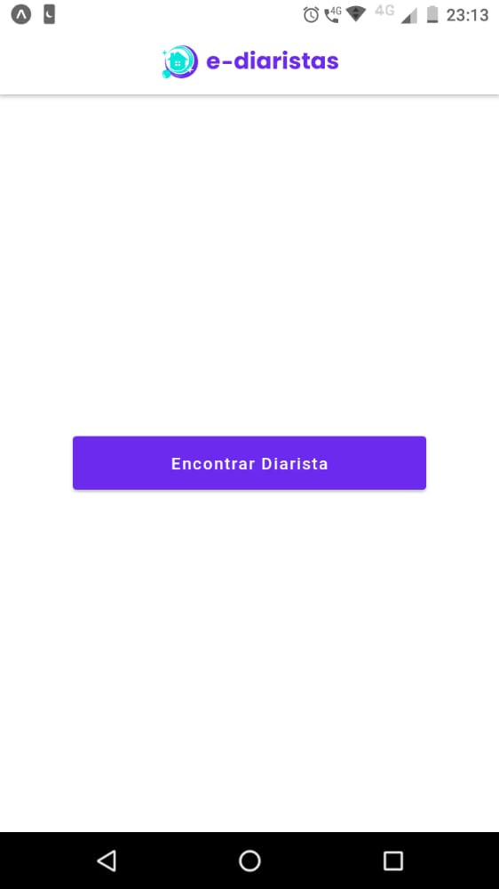

# TreinaWebMultiStack

## Projeto e-diaristas

💻 **_Front End_** 💻

> Na etapa do Front End, foi utilizado o React com o Next para estilizar o site, onde foi definido usando os hooks do React toda a estilização e layout do projeto.

📷Print do site em funcionamento, é possivel acessar o projeto ao baixar o projeto e usando o comando _npm run dev_ para abrir o localhost:3000📷:

🗃 **_Back End_** 🗃

> Na etapa do Back End, foi dada a opção de escolher entre PHP, Python e Java, usando os frameworks, Laravel, Django e Spring. Eu escolhi o Python/Django, é a linguagem a qual escolhi e estou amando aprender. Com o Django foi criado um CRUD onde foi possivel cadastrar as diaristas do projeto, assim editar ou remover as mesmas. Pude aprender a criar uma API, na qual foi usada para juntar o Front End e o Back End.

📷 Print do CRUD em execução, poderá ser executado estando dentro da venv, no caminho _\treinawebmultistack\ediaristas-backend\ediaristas_workshop_, uma vez no caminho, basta executar o comando '_python manage.py runserver_ **só funcionará dentro da venv** que irá lhe abrir o *http://127.0.0.1:8000/web/cadastrar_diarista* 📷:
 

📲 **_Mobile_** 📲

> No mobile foi usado o React Native para fazer a aplicação e usado o Expo para vizualizar o desenvolvimento do projeto.

📷 Print do app funcionando no dispositivo. Basta abrir a pasta e executar o comando #expo start 📷:
 

🤩 **_Skills obtidas_**🤩

> Pude aprender um pouco sobre React, Next e React Native. O que me proporcionou um conhecimento melhor no Front End. E também pude aprender mais sobre Python com Django!
> Todos os agradecimentos a TreinaWeb!
